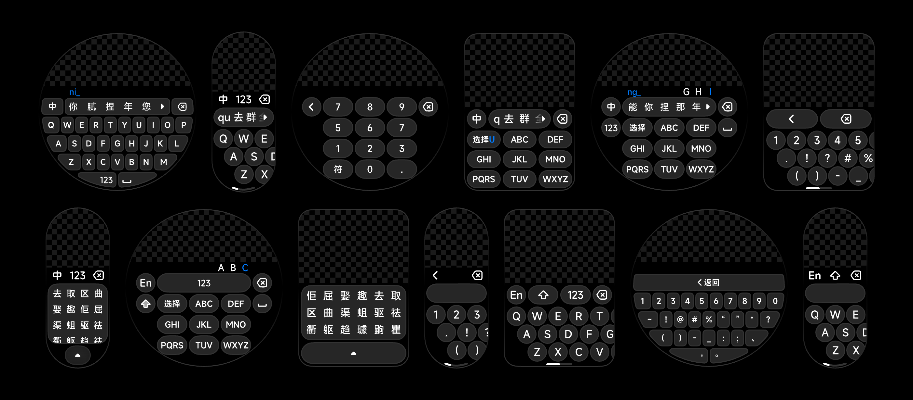

# Vela_input_method
 三⽅输⼊法组件

## 手动安装

### 下载项目代码

```bash
git clone https://github.com/NEORUAA/Vela_input_method.git
```

### 拷贝代码
把项目中的 components 文件夹拷贝到要使用组件的项目 src 目录下。然后就可以按照自定义组件的使用方式来使用本组件了。

---

## 组件名称
input-method

## 概述
输⼊法功能

## ⼦组件
不⽀持

## 属性
| 名称 | 类型 | 默认值 | 必填 | 描述 |
| --------  | :----:  | :----:  | :----:  | :---- |
| hide | boolean | true | 是 | 是否显⽰键盘（开发者可以通过切换属性值隐藏或者唤醒键盘） |
| keyboardtype | string | "QWERTY" | 否 | 键盘布局，"QWERTY" 表⽰全键，"T9" 表⽰九键。默认为 "QWERTY"（当 screentype 非 "circle" 时，仅全键盘可用） |
| maxlength | number | 5 | 否 | 默认展⽰的拼⾳候选词数量， maxlength > 0 时有效；点击展开查看所有候选词 |
| vibratemode | string | "" | 否 | 振动模式，""表⽰输⼊时不振动，"long" 表⽰⻓振动，"short" 表⽰短振动。默认为 "" |
| screentype | string | "circle" | 否 | 设备屏幕类型，"rect" 表示方形屏布局（对应 designWidth ≥ 336），"circle" 表示圆形屏布局（对应 designWidth 为 480），"pill-shaped" 表示胶囊形屏布局（对应 designWidth ≥ 192） |

## 事件
| 名称 | 参数 | 描述 |
| --------  | :-----  | :---- |
| complete | { detail: { content: string } } | 键盘输出字符时触发（当切换为中⽂输⼊法时候，当选中拼⾳对应⽂字时触发；当切换为英⽂输⼊法时，与 keyDown 触发条件⼀致）|
| delete | - | 键盘点击删除按钮触发 |
| keyDown | { detail: { content: string } } | 键盘按钮按下时触发 |
| visibilityChange | { detail: { visible: boolean } } | 键盘显示或隐藏时触发，visible 表⽰显示状态 |

## ⽰例代码
```html
<import name="input-method" src="../../components/InputMethod/InputMethod.ux"></import>
<template>
  <div class="page" style="flex-direction: column;">
    <text class="text" @click="changeState">
      {{textValue}}_
    </text>
    <input-method
      hide="{{hide}}"
      keyboardtype="{{keyboardtype}}"
      maxlength="5"
      vibratemode="{{vibratemode}}"
      screentype="{{screentype}}"
      @visibility-change="onVisibilityChange"
      @key-down="onKeyDown"
      @delete="onDelete"
      @complete="onComplete"
    ></input-method>
  </div>
</template>

<script>
export default {
  private: {
    textValue: "",
    hide: false,
    keyboardtype: "QWERTY", //QWERTY, T9
    vibratemode: "short",
    screentype: "circle", //pill-shaped, rect, circle
  },
  onVisibilityChange(evt) {
    console.log("显示状态变更:"+JSON.stringify(evt));
  },
  onKeyDown(evt) {
    // this.textValue += evt.detail.content;
    console.log("按下按键:"+JSON.stringify(evt));
  },
  onDelete() {
    this.textValue = this.textValue.slice(0, -1);
    console.log("删除字符");
  },
  changeState() {
    this.hide = !this.hide;
  },
  onComplete(evt) {
    this.textValue += evt.detail.content;
    console.log("返回字符:"+JSON.stringify(evt));
  },
};

</script>

<style>
.page{
  width:480px;
  height:480px;
}

.text{
  position:absolute;
  left:0;
  top:60px;
  width:100%;
  height:80px;
  text-align:center;
  color:white;
  background-color: red;
}
</style>
```
